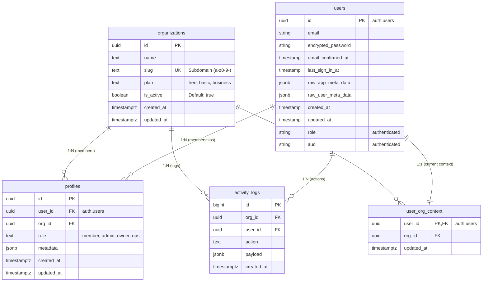

# ドメイン仕様書

本ドキュメントは、現在のソースコードおよびE2Eテストに基づき、マルチテナントSaaSアプリケーションの各ドメインの仕様をまとめたものです。

## 概要

アプリケーションは4つの異なるドメインに分割されており、それぞれ特定の目的と対象ユーザーを持ちます。認証はSupabase Session Cookieを介して共有されますが、認可とルーティングは大きく異なります。

| ドメイン | 目的 | URLパターン | 対象ユーザー | 認証要件 |
| :--- | :--- | :--- | :--- | :--- |
| **www** | マーケティング / LP | `www.example.com` | 一般公開 | なし |
| **app** | SaaSアプリケーション | `[slug].app.example.com` | Member, Admin, Owner | 必須 (ログインへリダイレクト) |
| **admin** | 管理コンソール | `admin.example.com` | Admin, Owner | 必須 (ログインへリダイレクト) |
| **ops** | 社内運用ツール | `ops.example.com` | Ops Staff | 必須 (権限なしは404) |

---

## データベーススキーマ

マイグレーションファイルに基づく正確なスキーマ定義です。

### ER図

### テーブル詳細定義

#### 1. organizations (組織)
テナント情報を管理します。
*   `id` (UUID): プライマリキー (`gen_random_uuid()`)。
*   `name` (TEXT): 組織名。
*   `slug` (TEXT): **ユニーク**。サブドメインとして使用。
    *   制約: 英小文字、数字、ハイフンのみ (`^[a-z0-9-]+$`)。
    *   除外キーワード: `www`, `app`, `admin`, `ops`, `api`, `static`, `assets` は使用不可。
*   `plan` (TEXT): 契約プラン。デフォルト `'free'`。
*   `is_active` (BOOLEAN): 有効状態。デフォルト `true`。
*   `created_at`, `updated_at`: タイムスタンプ。

#### 2. profiles (所属プロフィール)
ユーザーの組織への所属とロールを管理します。
*   `id` (UUID): プライマリキー。
*   `user_id` (UUID): 外部キー (`auth.users.id`)。
*   `org_id` (UUID): 外部キー (`organizations.id`)。削除時 `CASCADE`。
*   `role` (TEXT): ロール。以下のいずれか:
    *   `'member'`, `'admin'`, `'owner'`, `'ops'`
*   `metadata` (JSONB): 追加情報。デフォルト `{}`。
*   **ユニーク制約**: `(user_id, org_id)`。

#### 3. activity_logs (監査ログ)
操作ログを記録します。
*   `id` (BIGSERIAL): プライマリキー。
*   `org_id` (UUID): 外部キー (`organizations.id`)。削除時 `CASCADE`。
*   `user_id` (UUID): 操作ユーザーID。
*   `action` (TEXT): 操作種別。
*   `payload` (JSONB): 詳細データ。デフォルト `{}`。
*   `created_at`: 作成日時。

#### 4. user_org_context (ユーザー組織コンテキスト)
ユーザーの「現在のアクティブな組織」を保持します。
*   `user_id` (UUID): プライマリキー兼外部キー (`auth.users.id`)。削除時 `CASCADE`。
*   `org_id` (UUID): 外部キー (`organizations.id`)。削除時 `CASCADE`。
*   `updated_at`: 更新日時。

#### 5. users (システムユーザー)
**Supabase Auth (`auth.users`)** の標準スキーマです。アプリケーションはこれらのカラムを直接管理せず、Supabase Auth APIを通じて利用します。

| カラム名 | 型 | 説明 |
| :--- | :--- | :--- |
| `id` | `uuid` | ユーザーの一意な識別子。 |
| `aud` | `varchar` | オーディエンス（通常は "authenticated"）。 |
| `role` | `varchar` | ユーザーロール（通常は "authenticated"）。 |
| `email` | `varchar` | ユーザーのメールアドレス。 |
| `encrypted_password` | `varchar` | 暗号化されたパスワード。 |
| `email_confirmed_at` | `timestamptz` | メール確認日時。 |
| `invited_at` | `timestamptz` | 招待日時。 |
| `confirmation_token` | `varchar` | 確認トークン。 |
| `confirmation_sent_at` | `timestamptz` | 確認メール送信日時。 |
| `recovery_token` | `varchar` | パスワードリセットトークン。 |
| `recovery_sent_at` | `timestamptz` | パスワードリセットメール送信日時。 |
| `email_change_token_new` | `varchar` | 新しいメールアドレス変更トークン。 |
| `email_change` | `varchar` | 変更予定の新しいメールアドレス。 |
| `email_change_sent_at` | `timestamptz` | メール変更メール送信日時。 |
| `last_sign_in_at` | `timestamptz` | 最終ログイン日時。 |
| `raw_app_meta_data` | `jsonb` | アプリケーションメタデータ（`provider`, `providers` 等）。 |
| `raw_user_meta_data` | `jsonb` | ユーザーメタデータ（プロフィール情報等）。 |
| `is_super_admin` | `bool` | スーパー管理者フラグ。 |
| `created_at` | `timestamptz` | 作成日時。 |
| `updated_at` | `timestamptz` | 更新日時。 |
| `phone` | `varchar` | 電話番号。 |
| `phone_confirmed_at` | `timestamptz` | 電話番号確認日時。 |
| `phone_change` | `varchar` | 変更予定の電話番号。 |
| `phone_change_token` | `varchar` | 電話番号変更トークン。 |
| `phone_change_sent_at` | `timestamptz` | 電話番号変更メール送信日時。 |
| `confirmed_at` | `timestamptz` | アカウント確認日時。 |
| `email_change_token_current` | `varchar` | 現在のメールアドレス変更トークン。 |
| `email_change_confirm_status` | `smallint` | メール変更確認ステータス。 |
| `banned_until` | `timestamptz` | BAN期限。 |
| `reauthentication_token` | `varchar` | 再認証トークン。 |
| `reauthentication_sent_at` | `timestamptz` | 再認証メール送信日時。 |
| `is_sso_user` | `bool` | SSOユーザーフラグ。 |
| `deleted_at` | `timestamptz` | 削除日時。 |

---

## 1. WWW ドメイン (マーケティング)

*   **パス**: `apps/www`
*   **Middleware**: `apps/www/middleware.ts`
*   **アクセス制御**: 誰でもアクセス可能。
*   **主な機能**:
    *   **ランディングページ (LP)** (`/`): サービスの紹介、特徴、CTA。
    *   **ログインページ** (`/login`):
        *   全ての保護されたドメインからのリダイレクト先。
        *   `?next=` パラメータを受け取り、ログイン後に元のページへ戻す。
        *   メール/パスワード認証、ソーシャルログイン（将来用）。
    *   **認証コールバック** (`/auth/callback`): Supabase Authのコールバック処理。
*   **データ観点**:
    *   **読み取り**: なし（静的コンテンツのみ）。
    *   **書き込み**: Supabase Authへの認証リクエストのみ。

---

## 2. App ドメイン (SaaSプロダクト)

*   **パス**: `apps/app`
*   **Middleware**: `apps/app/middleware.ts`
*   **URL構造**: ホストベースのルーティング (`[slug].app.example.com`)。
*   **アクセス制御**: `member`, `admin`, `owner` ロール。
*   **主な機能**:
    *   **ダッシュボード** (`/dashboard`):
        *   日々の業務状況の概要表示。
        *   組織ごとのウィジェット表示。
    *   **組織スイッチャー**:
        *   ヘッダーに常設。
        *   ユーザーが所属する他の組織（サブドメイン）へワンクリックで遷移。
    *   **ログアウト**:
        *   全ドメイン共通のセッション破棄。
    *   **未承認ページ** (`/unauthorized`):
        *   権限がないリソースへアクセスした際のエラー表示。
*   **データ観点**:
    *   **Organizations**: 自分の所属する組織情報 (`id`, `name`, `slug`) の参照。
    *   **Profiles**: 自信のプロフィール (`role`) の参照。
    *   **Business Data**: (将来実装) 組織に紐づく業務データのCRUD。RLSにより他組織のデータは不可視。

---

## 3. Admin ドメイン (管理画面)

*   **パス**: `apps/admin`
*   **Middleware**: `apps/admin/middleware.ts`
*   **URL構造**: パス/クエリベース (`admin.example.com/path?org=[slug]`)。
*   **アクセス制御**: **`admin`, `owner` ロールのみ**。
*   **主な機能**:
    *   **ダッシュボード** (`/`):
        *   管理タスクの概要。
    *   **メンバー管理** (`/members`):
        *   **一覧表示**: 組織メンバーの一覧、ロール、ステータス確認。
        *   **招待**: 新規メンバーをメールアドレスで招待（モーダルUI）。
        *   **編集**: メンバーのロール変更（Ownerは変更不可などの制約あり）。
        *   **削除**: メンバーの組織からの削除。
    *   **監査ログ** (`/audit-logs`):
        *   **閲覧**: 組織内の操作履歴（誰が、いつ、何をしたか）のリスト表示。
        *   **フィルタ**: 日付、操作ユーザー、アクションタイプでの絞り込み。
    *   **組織設定** (`/org-settings`):
        *   **基本設定**: 組織名の変更。
        *   **プラン管理**: ビジネスプランへのアップグレード等（Ownerのみ）。
        *   **危険な操作**: 組織の削除、権限譲渡（Ownerのみ）。
    *   **動的ルート** (`/org/[slug]/...`):
        *   特定の組織コンテキストをURLパスで固定してアクセスする機能。
*   **データ観点**:
    *   **Profiles**: `org_id` でフィルタされたメンバー情報の参照・更新・削除。
    *   **Activity Logs**: `org_id` でフィルタされた操作ログの参照（InsertはトリガーまたはServer Action）。
    *   **Organizations**: `org_id` でフィルタされた組織設定の参照・更新。

---

## 4. Ops ドメイン (社内ツール)

*   **パス**: `apps/ops`
*   **Middleware**: `apps/ops/middleware.ts`
*   **URL構造**: シンプルなパス (`ops.example.com`)。
*   **アクセス制御**: **`ops` ロールのみ**（未認証は404）。
*   **主な機能**:
    *   **ダッシュボード** (`/`):
        *   システム全体の統計情報（総組織数、総ユーザー数など）。
    *   **組織管理** (`/orgs`):
        *   **全組織一覧**: システム上の全テナントをリスト表示。
        *   **詳細・編集**: 任意の組織のプラン変更、スラッグ変更、強制機能制限。
        *   **凍結**: 規約違反などの理由によるテナントの一時停止（ログイン不可にする）。
        *   **削除**: テナントの強制削除。
    *   **専用ログイン** (`/login`):
        *   Opsスタッフ専用の入り口（一般ユーザーには非公開）。
*   **データ観点**:
    *   **Organizations**: 全組織データの参照・更新・削除（RLSバイパスまたはOps用ポリシー適用）。
    *   **Profiles**: 全ユーザーの参照（必要に応じて）。
    *   **System Metrics**: (将来実装) システム全体の利用統計など。

---

## 横断的な関心事

### 認証とセッション
*   **メカニズム**: Supabase Auth (Session Cookie)。
*   **スコープ**: Cookieはサブドメイン間 (`.example.com` または `.local.test`) で共有される。
*   **ログインフロー**: 保護されたドメインへの未認証アクセスは、すべて `www/login` へリダイレクトされる (`?next=` パラメータ付き)。

### データ分離 (RLS)
*   **原則**: Row Level Security (RLS) が主要な強制メカニズムである。
*   **実装**:
    *   Postgresポリシーが `auth.uid()` と `org_id` をチェックする。
    *   ユーザーがURLを操作して (`?org=other` など) アクセスを試みても、データベースは空の結果を返すかエラーとなる（権限がないため）。
*   **検証**: E2Eテスト (`p4-boundary`) により、組織間のデータアクセスが不可能であることが明示的に検証されている。

### 組織の切り替え
*   **App ドメイン**: 組織を切り替えると、新しいサブドメインへフルページリロード（遷移）する。
*   **Admin ドメイン**: 組織を切り替えると、`?org=` クエリパラメータまたはパスが更新され、同じホスト上に留まる。
