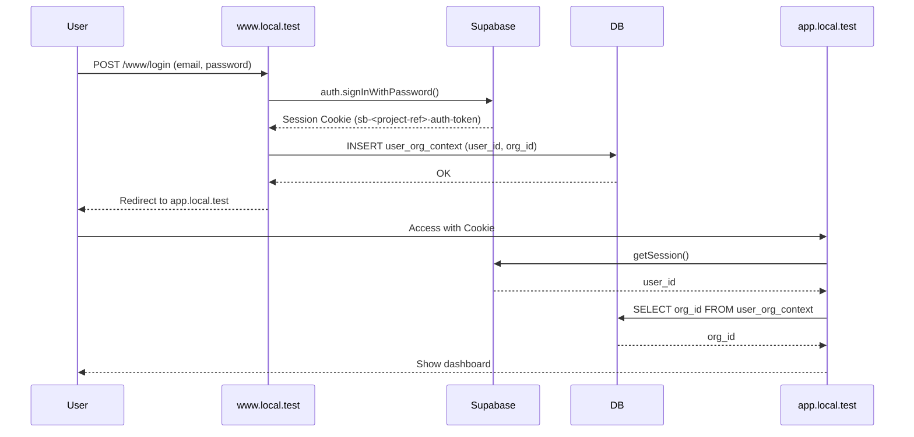

# 認証・認可パターン

このドキュメントでは、本アプリケーションの認証（Authentication）・認可（Authorization）の実装パターンを説明します。

## 目次
- [基本原則](#基本原則)
- [認証フロー](#認証フロー)
- [認可チェック](#認可チェック)
- [実装パターン](#実装パターン)
- [アンチパターン](#アンチパターン)
- [トラブルシューティング](#トラブルシューティング)

## 基本原則

### 1. Single Source of Truth
- **認証情報は Supabase Session Cookie のみ**（`sb-<project-ref>-auth-token` 形式）
- **認可情報（org_id, role）は DB から取得**
- Cookie に認可情報を保存しない

### 2. Defense in Depth（多層防御）
```
Layer 1: middleware      → 認証チェック（Supabase Session Cookie の有無）
Layer 2: Server Component → DB から org_id/role を取得、認可チェック
Layer 3: RLS (Row Level Security) → PostgreSQL でデータアクセス制御
```

### 3. Edge Runtime と Node Runtime の分離
- **middleware**: Edge Runtime（DB アクセス不可）
- **Server Components/Actions**: Node Runtime（DB アクセス可）

### 4. Trust but Verify（信頼するが検証する）
- Cookie はヒントとして扱う
- 重要な操作では必ず DB で再検証
- RLS で最終的なアクセス制御

## 認証フロー

### ログインフロー


### 認証チェック（middleware）
```typescript
// apps/*/middleware.ts
export function middleware(request: NextRequest) {
  // Supabase Session Cookie の存在確認のみ
  const hasSupabaseSession = Array.from(request.cookies.getAll()).some(
    cookie => cookie.name.startsWith('sb-') && cookie.name.includes('auth-token')
  );

  // 未認証の場合、www/login へリダイレクト
  if (!hasSupabaseSession) {
    return NextResponse.redirect(new URL('/www/login', DOMAINS.WWW));
  }

  return NextResponse.next();
}

export const config = {
  matcher: ['/((?!api|_next/static|_next/image|favicon.ico).*)']
};
```

**重要**: middleware では以下を行わない
- ❌ DB アクセス（Edge Runtime 制約）
- ❌ org_id/role の検証（DB が必要）
- ❌ 詳細な認可チェック（Server Component で実施）

## 認可チェック

### Server Component での認可
```typescript
// apps/admin/app/members/page.tsx
import { getCurrentRole } from '@repo/config';
import { notFound } from 'next/navigation';

export default async function MembersPage() {
  const roleContext = await getCurrentRole();
  const role = roleContext?.role;

  // 認可チェック: owner のみアクセス可能
  if (!role || role !== 'owner') {
    notFound(); // 404 を返す（403 は Server Component で直接返せない）
  }

  // 認可OK、ページを表示
  return (
    <div>
      <h1>Members Management</h1>
      {/* ... */}
    </div>
  );
}
```

### Server Action での認可
```typescript
// apps/admin/app/members/actions.ts
'use server';

import { getCurrentRole } from '@repo/config';
import type { ActionResult } from '@repo/config/types';

export async function deleteMember(memberId: string): Promise<ActionResult<void>> {
  // 認可チェック
  const roleContext = await getCurrentRole();
  if (!roleContext || roleContext.role !== 'owner') {
    return {
      success: false,
      error: 'Unauthorized: owner role required',
    };
  }

  // 実行
  const supabase = await createServerClient();
  const { error } = await supabase
    .from('profiles')
    .delete()
    .eq('id', memberId);

  if (error) {
    return {
      success: false,
      error: error.message,
    };
  }

  return {
    success: true,
    nextUrl: '/members', // クライアント側で遷移
  };
}
```

**重要**: Server Action では
- ✅ `ActionResult<T>` 型を返す
- ✅ `{ success, error, nextUrl }` の形式
- ❌ `redirect()` を使わない（ESLint で禁止）

## 実装パターン

### パターン1: ページレベル認可
```typescript
// 例: admin ドメインのページ
export default async function AdminPage() {
  const roleContext = await getCurrentRole();

  if (!roleContext || roleContext.role !== 'owner') {
    notFound();
  }

  return <AdminDashboard />;
}
```

### パターン2: 組織コンテキスト取得
```typescript
// 例: 現在の組織情報を取得
export default async function OrgSettingsPage() {
  const orgContext = await getCurrentOrg();

  if (!orgContext) {
    notFound();
  }

  return (
    <div>
      <h1>{orgContext.orgName} Settings</h1>
      {/* ... */}
    </div>
  );
}
```

### パターン3: ロールベース表示切り替え
```typescript
// クライアントコンポーネント側で使用
export default async function DashboardPage() {
  const roleContext = await getCurrentRole();

  return (
    <Dashboard>
      {roleContext?.role === 'owner' && (
        <AdminPanel />
      )}
      {roleContext?.role === 'admin' && (
        <ModeratorPanel />
      )}
      <MemberPanel />
    </Dashboard>
  );
}
```

### パターン4: 組織切り替え
```typescript
// Server Action での組織切り替え
'use server';

export async function switchOrganization(newOrgId: string): Promise<ActionResult<void>> {
  const supabase = await createServerClient();
  const { data: { session } } = await supabase.auth.getSession();

  if (!session?.user?.id) {
    return { success: false, error: 'Not authenticated' };
  }

  // user_org_context を UPDATE
  const { error } = await supabase
    .from('user_org_context')
    .update({ org_id: newOrgId, updated_at: new Date().toISOString() })
    .eq('user_id', session.user.id);

  if (error) {
    return { success: false, error: error.message };
  }

  return {
    success: true,
    nextUrl: '/', // ホームにリダイレクト
  };
}
```

## アンチパターン

### ❌ アンチパターン1: Cookie に認可情報を保存
```typescript
// 悪い例
response.cookies.set('org_id', orgId);
response.cookies.set('role', role);

// なぜ悪いか:
// - Cookie は改ざん可能
// - DB との同期が必要
// - セキュリティリスク
```

**正しい方法**: DB から取得する
```typescript
// 良い例
const orgContext = await getCurrentOrg();
const roleContext = await getCurrentRole();
```

### ❌ アンチパターン2: middleware で DB アクセス
```typescript
// 悪い例
export async function middleware(request: NextRequest) {
  const supabase = createServerClient(); // ❌ Edge Runtime で動かない
  const { data } = await supabase.from('profiles').select('role');
  // ...
}

// なぜ悪いか:
// - Edge Runtime は Node.js API にアクセスできない
// - @supabase/ssr は DB 接続に Node 依存がある
```

**正しい方法**: Server Component で DB アクセス
```typescript
// 良い例（Server Component）
export default async function Page() {
  const roleContext = await getCurrentRole(); // ✅ Node Runtime
  // ...
}
```

### ❌ アンチパターン3: Server Action で redirect()
```typescript
// 悪い例
'use server';
import { redirect } from 'next/navigation';

export async function createPost(data: FormData) {
  // ... DB 処理 ...
  redirect('/posts'); // ❌ ESLint エラー
}

// なぜ悪いか:
// - エラーハンドリングが困難
// - クライアント側でのフィードバックが難しい
```

**正しい方法**: ActionResult を返す
```typescript
// 良い例
export async function createPost(data: FormData): Promise<ActionResult<Post>> {
  // ... DB 処理 ...
  return {
    success: true,
    data: newPost,
    nextUrl: '/posts',
  };
}

// クライアント側
const result = await createPost(formData);
if (result.success && result.nextUrl) {
  router.push(result.nextUrl);
}
```

### ❌ アンチパターン4: 旧 Cookie 管理関数の使用
```typescript
// 悪い例
import { setSharedCookie } from '@repo/config/src/cookies'; // ❌ ESLint エラー

// なぜ悪いか:
// - このファイルは削除済み
// - Supabase Session のみを使用すべき
```

**正しい方法**: Supabase のセッション管理に任せる
```typescript
// 良い例
const supabase = await createServerClient();
await supabase.auth.signInWithPassword({ email, password });
// Supabase が自動で Session Cookie を設定
```

## トラブルシューティング

### 問題1: 認証後にリダイレクトされない

**症状**: ログイン成功後も `/www/login` にとどまる

**原因**: Supabase Session Cookie が設定されていない

**解決策**:
1. Cookie domain が `.local.test` に設定されているか確認
2. `/etc/hosts` に `127.0.0.1 www.local.test app.local.test` があるか確認

```typescript
// packages/db/src/index.ts で確認
cookieStore.set(name, value, {
  ...options,
  domain: '.local.test', // ← これが必要
});
```

### 問題2: 組織切り替え後に古い org_id が表示される

**症状**: `switchOrganization()` 実行後も古い組織情報が表示される

**原因**: キャッシュされたデータが残っている

**解決策**:
1. Server Component のキャッシュを無効化
2. revalidatePath() を使用

```typescript
import { revalidatePath } from 'next/cache';

export async function switchOrganization(newOrgId: string): Promise<ActionResult<void>> {
  // ... UPDATE処理 ...

  revalidatePath('/'); // キャッシュをクリア

  return { success: true, nextUrl: '/' };
}
```

### 問題3: middleware で "Cannot access DB" エラー

**症状**: middleware で DB 関数を呼ぶとエラー

**原因**: Edge Runtime は Node.js API にアクセスできない

**解決策**: DB アクセスを Server Component に移動

```typescript
// ❌ 悪い例
export async function middleware(request: NextRequest) {
  const role = await getCurrentRole(); // エラー
}

// ✅ 良い例
export function middleware(request: NextRequest) {
  // 認証チェックのみ
  const hasSession = Array.from(request.cookies.getAll()).some(
    cookie => cookie.name.startsWith('sb-')
  );

  if (!hasSession) {
    return NextResponse.redirect(DOMAINS.WWW);
  }

  return NextResponse.next();
}

// Server Component で認可チェック
export default async function Page() {
  const role = await getCurrentRole(); // ✅ OK
}
```

## 参考資料
- [ADR-005: Edge Middleware と Node サーバ処理の分離](../adr/ADR-005-edge-middleware-separation.md)
- [ADR-006: Supabase Session Cookie 専用認証への移行](../adr/ADR-006-supabase-session-only-authentication.md)
- [ADR-007: 組織コンテキストのDB管理（Cookie禁止）](../adr/ADR-007-org-context-in-database.md)
- [Server Actions パターン](./server-actions.md)
- [Edge Middleware パターン](./edge-middleware.md)
- [Cookies and Sessions パターン](./cookies-and-sessions.md)
